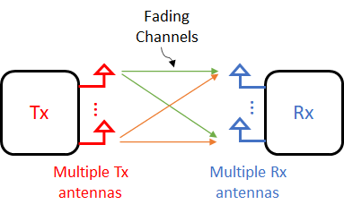
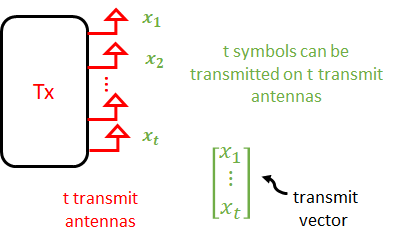
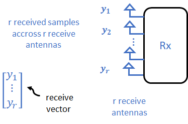
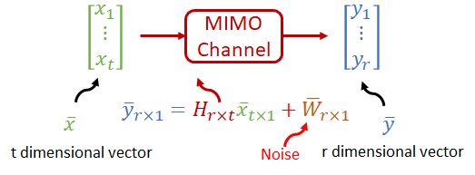
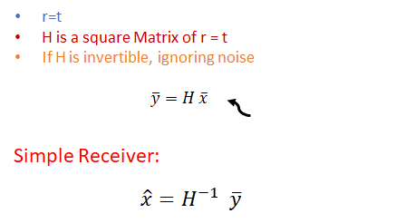
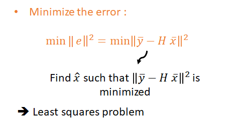
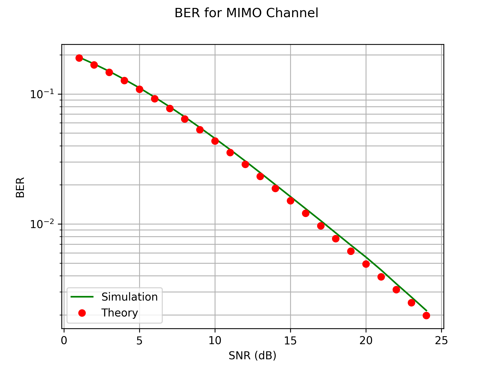

# Performance Analysis for Communication Systems 

The poor performance of the wireless communication system can be attributed to the deep fading events occuring because of the fading nature of the wireless channel.
To overcome this deep fade effects, we use the diversity principle.

In this project, we will present the diversity principle to combat fading and more precisely to overcome effects of the deep fade. Moreover, we simulate using Python this system model
and we present its bit error rate performance.

The project report contains the definition and the expression of : 
* [ MIMO ](#MIMO)
* [Model for MIMO](#Model-for-MIMO)
* [MIMO receiver](#MIMO-receiver)
* [Average BER](#Average-BER)

## MIMO

MIMO stands for multi-input multi-output wireless communication systems. The multiple-inputs are the multiple transmet antennas and multi-outputs imply the multiple receive antennas.
It is one of the latest milestones in the development of the wireless technology and it leads to the increase in the data rates. MIMO is a very important technology in the 3G and 4G communication system. The block diagram of a MIMO channel can be depicted as

Multiple antennas at the receiver lead receive diversity and thus to the increase of the realibility. In addition to diversity, it is possible to transmit a higher data rate and this is possible by transmitting several information streams in parallel. This is known as a spatial multiplexing. 

### Model for MIMO

At the transmitter, we have t transmit antennas so t symbols can be transmitted on t transmit antennas. See figure below:

At the receiver, we have r receive antennas so r receive symbols accross r receive antennas. See figure below:

The transmit vector is passsing through the MIMO channel and this is given rise to my receive vector:

The model is thzn

with 

The total number of channel coefficient in the MIMO system is r times t.

## MIMO Receiver

The MIMO system model is expressed as 

How to receover the transmit vector at the receiver ?

For a simple scenario, if the number of transmit antennas is equal to the number of receive antennas, we have :

If r>t, meaning number of receive antennas is strictly greater than number of transmit antennas, then H is not a square matrix. The inverse of H does not exist and in such a scenario, the number of equations is greater than the number of unkonws. This is an inconsistent system of equation. The best solution in this scenario is to minimise the norm of error square:

To find the minimum, we have to differentiale wrt to the transmit vector and set equal to zero. The LS solution, or the zero-forcing MIMO receiver is equal to:

## BER

The bit error rate for BPSK modulated symbols with zero-forcing receiver is basically equal to that of receive antenna system with MRC with L=r-t+1 antennas !

Therefore, approximate BER at high SNR is given by

Through our simulation using Python, the resulted BER curve against the theoretical probability of error is depicted in the figure below: 

